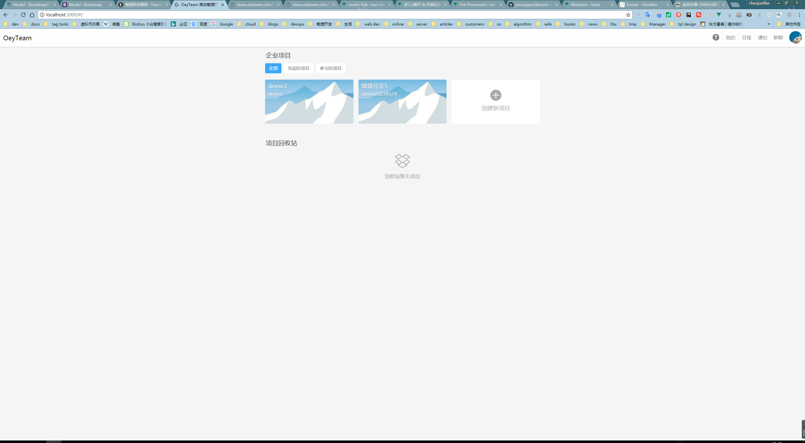
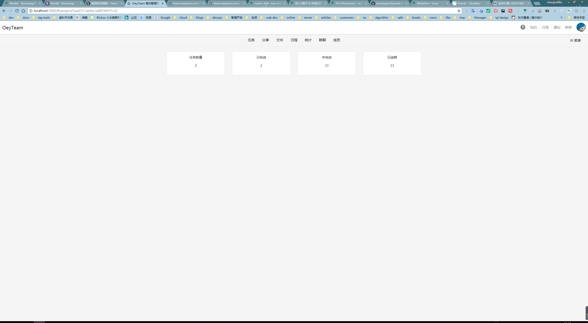
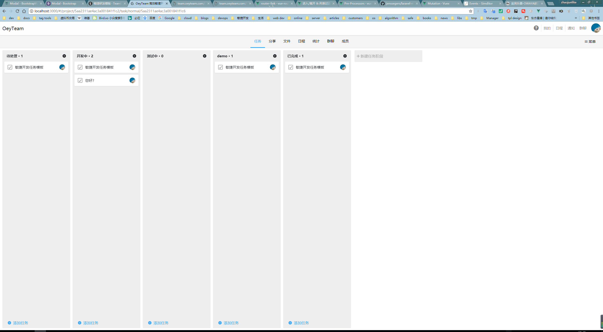
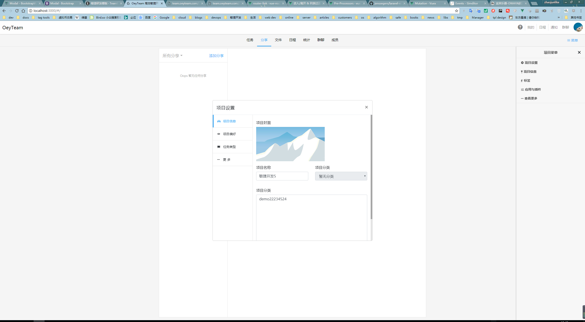

1.  全栈项目，为了实现试用Vue实现teambition大部分功能
2.  实现团队协作
3.  实现文件共享
4.  实现在线群聊
5.  实现文章分享

服务端项目请查看：
https://github.com/zhaojunlike/laravel-scrum-dev-paas

## Usage

## 技术栈
- vue
- vuex
- vue-router
- vue-cli
- axios
- bootstrap-4.0
- bootstrap-vue

## 部分截图

